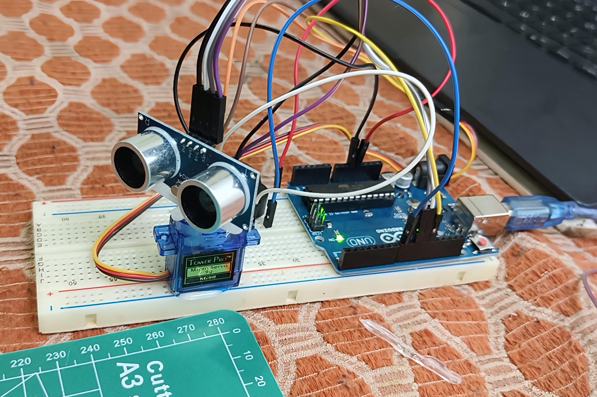
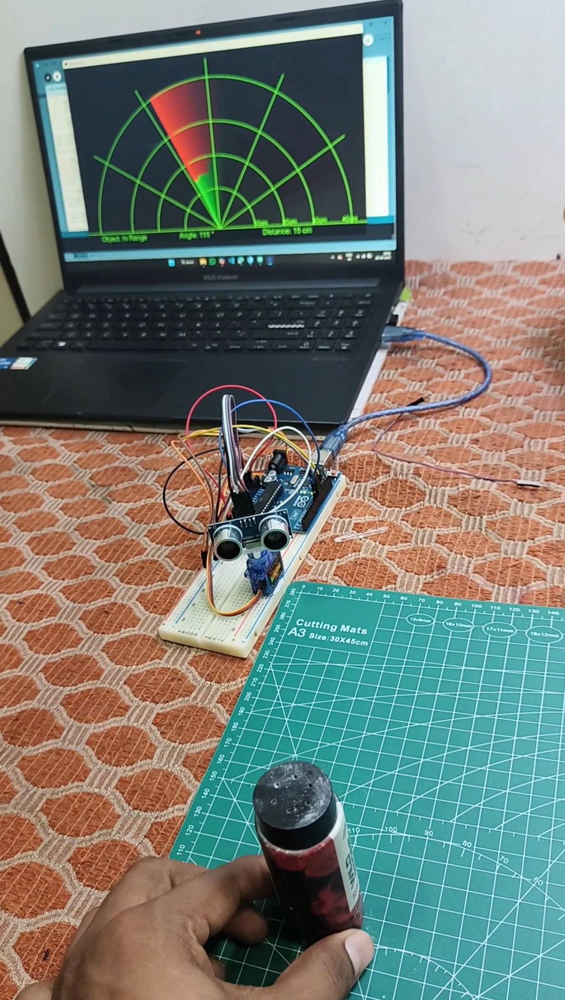
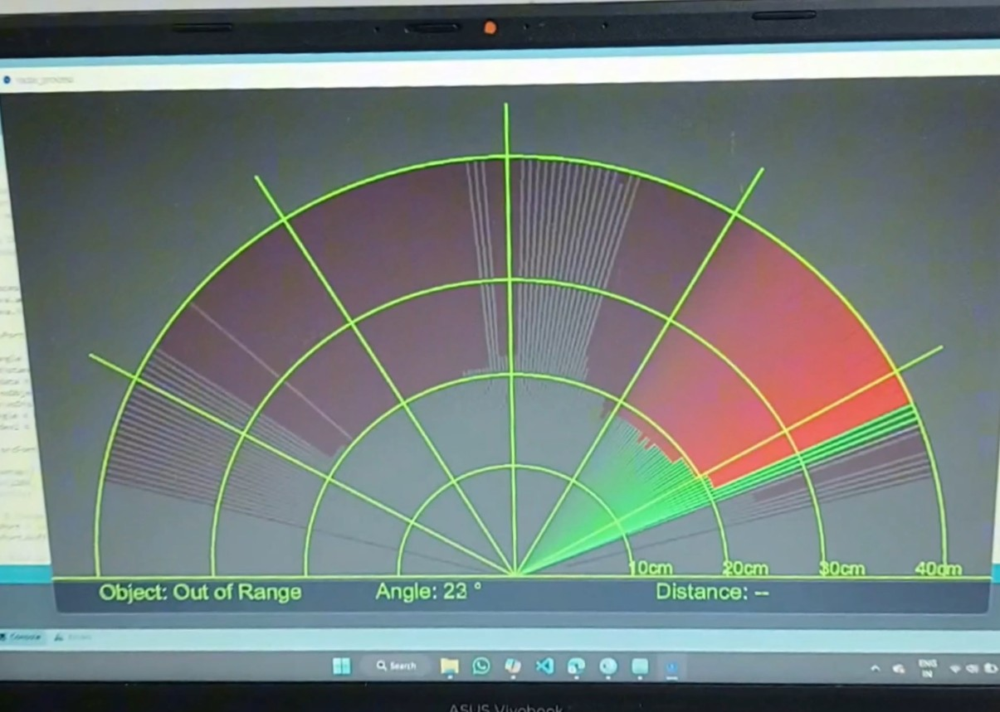
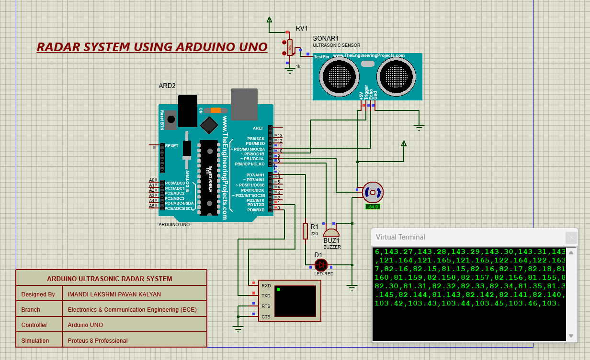

# Ultrasonic Radar System using Arduino 📡

A **180° ultrasonic radar system** built using **Arduino, HC-SR04 ultrasonic sensor, SG90 servo motor, and buzzer**, with a real-time radar visualization developed using **Processing 4**.

The ultrasonic sensor continuously sweeps from **0° to 180°** using the servo motor and measures the distance of detected objects. The measured angle and distance are transmitted from Arduino to Processing through serial communication and displayed on a graphical radar interface.

When an object is detected within the **30 cm alert range**, the target is highlighted in **red** and the buzzer is activated.

---

## 🎥 Demo Video

▶️ **[Watch the Ultrasonic Radar System Demo](https://youtu.be/Dc3oz8Ok7GA?si=FJcTpA1iOotcNZVX)**

---

## 📸 Project Images

### 🔧 Final Project


### 🛠️ Project Hardware



### 🎯 Radar Object Detection



### 📡 Radar Visualization



### 💻 Proteus Simulation


---

## ✨ Features

* 📡 **180° Radar Scanning**
* 📏 **Ultrasonic Distance Measurement**
* 🔄 **Servo-Controlled Sensor Sweeping**
* 💻 **Real-Time Processing 4 Visualization**
* 🎯 **Object Detection**
* 🚨 **30 cm Proximity Alert**
* 🔴 **Red Target Indication for Nearby Objects**
* 🔊 **Buzzer Alert**
* 📊 **Real-Time Angle and Distance Data**
* 🖥️ **Arduino-to-Processing Serial Communication**
* 🧪 **Proteus Simulation**

---

## 🧰 Hardware Required

| Component                 |    Quantity | Purpose                                      |
| ------------------------- | ----------: | -------------------------------------------- |
| Arduino UNO / Nano / Mega |           1 | Main controller                              |
| HC-SR04 Ultrasonic Sensor |           1 | Distance measurement                         |
| SG90 Micro Servo Motor    |           1 | 180° sensor movement                         |
| Buzzer                    |           1 | Proximity alert                              |
| Breadboard                |           1 | Circuit prototyping                          |
| Jumper Wires              | As required | Connections                                  |
| USB Cable                 |           1 | Arduino programming and serial communication |

---

## 🔌 Wiring Guide

| Component        | Arduino Pin |
| ---------------- | ----------- |
| **Servo Signal** | D9          |
| **HC-SR04 Trig** | D10         |
| **HC-SR04 Echo** | D11         |
| **Buzzer (+)**   | D12         |
| **VCC**          | 5V          |
| **GND**          | GND         |

---

## ⚙️ Working Principle

The system works in the following sequence:

1. The **SG90 servo motor** rotates the HC-SR04 ultrasonic sensor from **0° to 180°**.
2. At each angle, the **HC-SR04** sends an ultrasonic pulse.
3. The sensor receives the reflected echo from nearby objects.
4. Arduino calculates the distance using the echo time.
5. Arduino sends the **angle and distance values** to the computer through serial communication.
6. **Processing 4** receives the serial data.
7. Processing converts the data into a **real-time radar visualization**.
8. If an object is detected within **30 cm**, the radar target changes to **red**.
9. The buzzer produces an alert tone when the object enters the alert range.
10. The servo continues sweeping, providing continuous 180° scanning.

---

## 📐 Distance Calculation

The HC-SR04 measures distance based on the time taken by the ultrasonic pulse to travel to the object and return.

The distance is calculated using:

```text
Distance = (Echo Time × Speed of Sound) / 2
```

The division by **2** is required because the ultrasonic wave travels to the object and then returns to the sensor.

---

## 🚨 Proximity Alert

The system uses a **30 cm threshold** for object detection alerts.

| Distance | Radar Display | Buzzer |
| -------- | ------------- | ------ |
| > 30 cm  | Normal target | OFF    |
| ≤ 30 cm  | 🔴 Red target | ON     |
| > 400 cm | Out of range  | OFF    |

Readings beyond approximately **400 cm** are treated as out-of-range to keep the radar visualization clean.

---

## 💻 Software Used

### Arduino IDE

Used to program the Arduino and control:

* HC-SR04 ultrasonic sensor
* SG90 servo motor
* Buzzer
* Serial communication

### Processing 4

Used to create the graphical radar interface and visualize:

* Radar sweep
* Detected object position
* Object distance
* Detection angle
* Proximity warning

### Proteus

Used for circuit simulation and testing of the project.

---

## 📦 Required Libraries

### Arduino

The project uses the Arduino:

```text
Servo
```

The Servo library is commonly included with the Arduino IDE.

### Processing

The Processing sketch requires:

```text
Serial
```

To install it:

**Sketch → Import Library → Manage Libraries**

Search for **Serial** and install the required library.

---

## 🚀 How to Run the Project

### 1. Upload Arduino Code

Open:

```text
Code's/Arduino_Radar.ino
```

in the Arduino IDE.

Select your Arduino board and the correct COM port, then upload the program.

---

### 2. Connect the Hardware

Connect the components according to the wiring table.

Make sure:

* HC-SR04 VCC is connected to 5V.
* HC-SR04 GND is connected to GND.
* Servo signal is connected to D9.
* HC-SR04 Trig is connected to D10.
* HC-SR04 Echo is connected to D11.
* Buzzer is connected to D12.

---

### 3. Configure Processing

Open:

```text
Code's/Radar_Visualization.pde
```

Locate the serial port configuration in the Processing code.

For example:

```java
final String PORT_NAME = "COM3";
```

Change `COM3` to the COM port assigned to your Arduino.

For example:

```java
final String PORT_NAME = "COM5";
```

---

### 4. Run Processing

After uploading the Arduino code:

1. Keep the Arduino connected to the computer.
2. Close the Arduino Serial Monitor if it is open.
3. Open the Processing sketch.
4. Select **Run** in Processing.
5. The radar visualization will start.
6. Move an object in front of the ultrasonic sensor to test detection.

---

## 🧪 Proteus Simulation

The Proteus simulation files are available in:

```text
Proteus/
```

### Proteus Project

```text
Proteus/Radar_project.pdsprj
```

### Simulation Images




> **Note:** The Proteus simulation is provided for circuit testing and demonstration. The Processing radar visualization operates through serial communication with the Arduino.

---

## 📁 Repository Structure

```text
Ultrasonic-Radar-System-using-Arduino/
│
├── Code's/
│   ├── Arduino_Radar.ino
│   └── Radar_Visualization.pde
│
├── Hardware-&-Image's/
│   ├── Final-Project.png
│   ├── Project-IMG.jpg
│   ├── Radar-Detects.jpg
│   ├── Radar-View.jpg
│   └── Simulation-IMG.png
│
├── Proteus/
│   ├── Radar-View.jpg
│   ├── Radar_project.pdsprj
│   └── Simulation-IMG.png
│
└── README.md
```

---

## 🛠️ Technologies Used

* **Arduino**
* **HC-SR04 Ultrasonic Sensor**
* **SG90 Servo Motor**
* **Processing 4**
* **Proteus**
* **Serial Communication**
* **Embedded C / Arduino C++**

---

## 🎯 Applications

This project can be used as a basic platform for:

* 🤖 Robotics
* 🚗 Autonomous vehicles
* 🛡️ Object detection systems
* 📡 Distance measurement
* 🏠 Security systems
* 🧪 Embedded systems experiments
* 🎓 Electronics and engineering education
* 🔬 Sensor-based automation projects

---

## 🔮 Future Improvements

Possible improvements for the next version include:

* 📱 Wireless radar monitoring using ESP32
* 📶 Wi-Fi-based data transmission
* 📊 Improved radar graphics
* 🔊 Variable alert frequency based on distance
* 🎯 Multiple-object tracking
* 💾 Data logging
* 📈 Distance history and graphs
* 🖥️ Web-based radar dashboard
* 🔄 Automatic scanning optimization

---

## 👨‍💻 Author

**Imandi Lakshmi Pavan Kalyan Imandi**

Electronics & Communication Engineering

GitHub: **[Pavan Kalyan Imandi](https://github.com/PavankalyanECE/)**

LinkedIn: **[Lakshmi Pavan Kalyan Imandi](https://www.linkedin.com/in/pavan-kalyan-imandi/)**

---

## ⭐ Support

If you found this project useful or interesting, consider giving the repository a **⭐ Star** on GitHub.

Feel free to explore the source code, Proteus simulation, hardware images, and Processing visualization.
